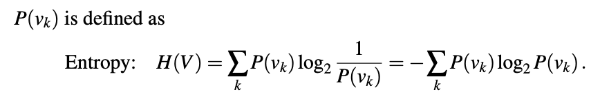

# Learning from Examples - Chatper 19 Up to 19.7.2

## Forms of Learning

`Induction` = specific set of observ. -> general rule

`Factored Representation` = a list (vector) of features/values of something

`Regression` = Where the output for the set of inputs is a `number`

`Classification` = Where the output for the set of inputs is a bunch of stuff that can be divided or 'classified'

`Attributes` = the features which define a test case.  (ie. Apples attributes: sour taste, red/green exterior, large etc)

### Supervised Learning

- Is directed; we give things labels (usually as part of testing set) and try to get the machine to give the correct label for new things/inputs

- We give it feedback (right guess/wrong guess)

- Test (input) and predictions (output) of the models can be graphed using polynomial functions.

#### 
`Hypothesis space` - the set of all possible models/functions a ML algo. can choose from to learn a relationship between input data and output predictions.

* We may use a (polynomial) function to 'fit' the models predictions to the actual outcomes that we are looking for.

* The model may build a `hypotheses - h` and we say that the hypothesis `generalize` well if it can accurately predict outputs given some set of test cases.

    - `Underfitting` - when the model fails to find a pattern in the data.  This may happen when a model is too simple and dail to take into account of relevant factors, leading to errors in prediction when given test data or new data.

    - `Overfitting` - when the model pays too much attention to the particular data set its trained on => failed/poor predictions when given unseen data.

        => These 'new' data may be completely different from the tests its seen previously or ONLY SOMEWHAT DIFFERENT

        - `Decision Tree Pruning` is a technique which removes unrelevant nodes in a tree => removing potential uneccessary conclusions.

            This technique combats overfitting.

### Unsupervised Learning  

- Not directed; we DO NOT give it feedback

- Tasks: clustering (detect clusters of cases that may become usefull)

### Reinforcement Learning

- Learning from reward and punishment

### Learning Decision Trees

* The model tries to reach for a resultby asking a series of questions.  With each Q&A towards the test case, it leads the model 'down' the tree and 'across' branches until it reaches a conclusion/preiction about the test csae at a leaf node.

    - In general, outputs can be discrete/continuous.  For now we consider the output to be BOOLEAN -> `T/F -> [+]/[-] output results only`

    - The nodes at each branch represents a yes/no answer, dividing up test cases across the branches as we filter down the decision tree.

#### How do we know the decision of the model at a branch is correct?

- `Entropy` measures the uncertainty of a random variable

    - `more info -> less entropy` // makes sense consider the more we know the more there is to go on

    - `we're absolutely sure` -> entropy is zero (eg. the sun always rises in the east)

    - `Random Variable (V) 

Prob. of uncertainty (entropy) of a random variable is P(Vk): 

- We test for significance by `assuming there's no underlying pattern in the data - NULL HYPOTHESIS` then test actual data and compare how test results fathom on par with test results where we presumed a pattern.

## Model Selection and Optimization

Our goal in ML is to selct a hypothesis that will optimally fit future examples.  To make that precise we need to define “future example” and “optimal fit.”

### 1. Defining Future Examples

First we will make the assumption that the future examples will be like the past. We call this the stationarity assumption; without it, all bets are off. We assume that each example Ej has the same prior probability distribution

### 2. Defining Optimal Fit

The model should pick a hypotheses that minimizes the error rate. `Error rates` may be estimated by measuring the models performance on a test set using the hypotheses.

- `Training Set` are used to train candidate models

- `Validation/Dev Set`  are used to evaluate candidate models and select the    
    best one.

- `Test Set` tests the model by utilizing test cases that have not been seen     
    before.

    #### Optimizing Learning with Minimal Data

    ##### K-Fold Cross Validation Technique

        1. Split your data into k equal chunks (say 5 or 10).

        2. Take one chunk out to test on, and use the rest to teach the computer.

        3. Repeat this so every chunk gets a turn as the “test chunk.”
        
        4. In the end, average all the results.
    
        *** Leave One Out Cross Validation is when you the chunk of data that is taken out and reserved for testing later consistes of only 1 test case.

### How to avoid messing up?

Take the email spam filter example:

    - Mistake 1 → A real email is marked as spam (you might miss something 
        important).

    - Mistake 2 → A spam email is marked as real (you just waste a few seconds 
        deleting it).

Both are “errors,” but they don’t hurt you equally. `Mistake 1 is worse.` So, just looking at the total error percentage hides this difference. A filter with a lower error rate could actually be worse for you if it makes the more harmful type of mistake more often.

`Parameters` = These are learned automatically from the data (like the weights in a neural network or the slope of a line in linear regression).

`Hyperparameters` = Settings we choose before the learning starts. They tell the learning process how to learn.

#### What we really want is to tell the computer:

`Maximizing Utility/Minimizing Loss` - Some mistakes matter more than others.
Focus on avoiding the bad mistakes, even if it means allowing a few of the less serious ones.

### How to speed up learning?

#### Bayesian Optimization (Smart Guessing)

- Choosing 'good' settings to tell the model how to learn before the training starts.  We should chose settings which has worked well before `(exploitation)` and ones that we haven't checked yet `(exploration)`

